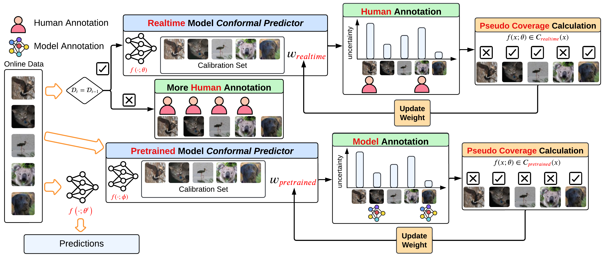

# Active Test-Time Adaptation with Conformal Prediction

### Description

**C**onformal **P**rediction **A**ctive **TTA** (CPATTA), a framework that integrates CP into ATTA. The core idea is to replace heuristic uncertainty measures with principled, coverage-guaranteed ones, and to adapt them to dynamic test-time environments. Specifically, CPATTA introduces three key components.
* CPATTA employs smoothed conformal scores and a top-K certainty measure to provide fine-grained uncertainty signals, enabling more efficient allocation of scarce human annotations and reliable pseudo-labeling.
* CPATTA develops an online weight-update algorithm that leverages pseudo coverage as feedback to dynamically correct coverage under domain shifts, ensuring that uncertainty estimates remain calibrated to the user-chosen risk level. 
* CPATTA incorporates a domain-shift detector that increases human supervision when a new domain is encountered, preventing error accumulation at the onset of sudden distributional changes. 

### Datasets
Please prepare PACS, VLCS, and Tiny-ImageNet-C

### Requirements
* Python: 3.11.6
* Pytorch: 2.5.1
* CUDA: 11.8

### Configs and Runner
* ``cpatta_config.yml``: An example config file for CPATTA algorithm
* ``data_config.yml``: An example config file for loading dataset
* ``runner.py``: A driver file for running the algorithm